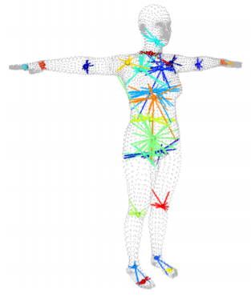
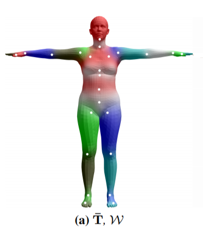

# Direct 3d Human Pose and Shape Estimation

The goal of this document is to dive deep into direct 3D pose and shape estimation based on human body prior. The problem statment is to recover 3D motion and body shape from monocular RGB video.

The document will dive deep into predicts the parameters of SMPL body model, parametrized 3d human body mesh, for each frame of an input video base on **V**ideo **I**nference for **B**ody
Pose and Shape **E**stimation (VIBE) https://github.com/mkocabas/VIBE.


This material should follow this notebook
[](https://github.com/ikvision/VIBE/blob/master/VIBE_and_SMPL.ipynb). The code presented below is more of a pseudo code for coherence, the full relevent code is linked.

# VIBE Overview

“VIBE” takes in-the-wild images as input and predicts SMPL body model parameters using a convolutional neural network [CNN](#cnn)
 pretrained on the single-image body pose and shape estimation task. The visual feature used by the CNN are encoded using a [Temporal Encoder](#temporal-encoder). The Estimated body pose and shape are used for [SMPL](#smpl) mesh generation. Than, a [Motion Discriminator](#motion-discriminator) takes predicted poses and outputs a real/fake label for each sequence.


In this following sections we will review the inference, forward pass, of the VIBE algorithm

# CNN

The  convolutional neural network predict body pose and shape on a single image input using the following sequential steps:

1. Image read and crop
   
    Read each image individually and crops the person using it's predefined bounding box
    [code](https://github.com/ikvision/VIBE/blob/0a4faaf231d76d68416adfc544e3e16cbeb67b16/lib/dataset/inference.py#L59-L70)

```python
img = cv2.imread(img_fname)
norm_img = get_single_image_crop_demo(img,bbox)
```

2. Extract ResNet Features
   
   Running the norm_img through a ResNet50 visual feature extraction. Uses 5 residual block of convolutions to generate the feature xf [code](https://github.com/ikvision/VIBE/blob/0a4faaf231d76d68416adfc544e3e16cbeb67b16/lib/models/spin.py#L220)

```python
x = self.conv1(norm_img)
x = self.bn1(x)
x = self.relu(x)
x = self.maxpool(x)
x1 = self.layer1(x)
x2 = self.layer2(x1)
x3 = self.layer3(x2)
x4 = self.layer4(x3)
xf = self.avgpool(x4)
```

3. Predict body pose, shape and camera
   Given the T-pose and the mean body shape and centered camera as inital prediction. Two Fully connected layers predict the current body shape,pose and camera position  [code](https://github.com/ikvision/VIBE/blob/0a4faaf231d76d68416adfc544e3e16cbeb67b16/lib/models/spin.py#L263-L271)

```python
xc = torch.cat([xf, pred_pose, pred_shape, pred_cam], 1)
xc = self.fc1(xc)
xc = self.drop1(xc)
xc = self.fc2(xc)
xc = self.drop2(xc)
pred_pose, pred_shape, pred_cam = self.decpose(xc)
```

4. Normalize Pose

   The pred_pose are relative rotation angles of the joint of size NJointsx3x2.
   Based on Zhou et al., "On the Continuity of Rotation Representations in Neural Networks". It is beneficial to represent joints angles in a continous form. This is done by orthogonal complemetation to create a rotation matrix that is NJointsx3x3  [code](https://github.com/ikvision/VIBE/blob/0a4faaf231d76d68416adfc544e3e16cbeb67b16/lib/models/spin.py#L92)

```python
b1 = F.normalize(pred_pose[:, :, 0], dim=1, eps=1e-6)
dot_prod = torch.sum(b1 * pred_pose[:, :, 1], dim=1, keepdim=True)
# Compute the second vector by finding the orthogonal complement to it
b2 = F.normalize(pred_pose[:, :, 1] - dot_prod * b1, dim=-1, eps=1e-6)
# Finish building the basis by taking the cross product
b3 = torch.cross(b1, b2, dim=1)
rot_mats = torch.stack([b1, b2, b3], dim=-1)
```
    
# SMPL
Given pred_pose and pred_shape the SMPL model returns the 3d human body mesh, pred_vertices, and it's corresponding pred_joints.The belly button rotation matrix, global_orient, is relative to the coordinate system origin. All other rotation matrices are relative to it and are denoted by body_pose  [code](https://github.com/ikvision/VIBE/blob/0a4faaf231d76d68416adfc544e3e16cbeb67b16/lib/models/spin.py#L275-L283)
```python
pred_vertices,pred_joints = self.smpl(betas=pred_shape,body_pose=pred_rotmat[:, 1:],global_orient=pred_rotmat[:, 0]
```
body shape coefficient effect on mesh

body_pose effect on meshs


SMPL performs Six sequential steps:
1. Linear Blend Shape

    Given the beta=pred_shape coefficients the T-Pose body shape is displaced according the the eignvectures of the body shapes as a weighted linear sum. This dispacment of vertices is added to a v_template - the average body shape mesh [code](https://github.com/vchoutas/smplx/blob/03813b7ffab9e9a9a0dfbf441329dedf5ae6176e/smplx/lbs.py#L262-L265)
   
    ```python
    # Displacement[b, m, k] = sum_{l} betas[b, l] * shape_disps[m, k, l] i.e. Multiply each shape displacement by it's corresponding beta and than sum them.
    blend_shape = torch.einsum('bl,mkl->bmk', [betas, shape_disps])
    v_shaped = v_template + blend_shape
    ```

2. Neutral Pose 3D Joint Regression
   
    Calculates the 3D joint locations from the vertices using a sparse J_regressor matrix. The location of joint is a weighted average of neibouring vertices
    
     [figure 7 SMPL paper]
    [code](https://github.com/vchoutas/smplx/blob/2144d5ca0272275e1b6f82af2a476d1f2c606814/smplx/lbs.py#L242)
```python
joints_3d = torch.einsum('bik,ji->bjk', [vertices, J_regressor])
```

3. Pose Blend Shape
   
   Linear blending creates foldind of skin around bended joint as the elbow. To correct the vertices before the rigging we apply a linear vertices dispalcement as a linear transformation.
   the green mesh is a linear blending, while the orange mesh includes the pose blend correction 
   
   [figure 2 SMPL Paper]
   [code](https://github.com/vchoutas/smplx/blob/2144d5ca0272275e1b6f82af2a476d1f2c606814/smplx/lbs.py#L200-L203)
   
```python
pose_offsets = torch.matmul(pose_feature,posedirs)
v_posed = pose_offsets + v_shaped
```

4. Calculate Joints 3D Location

   The 24-joints are represented by 23 relative rotation matrices corresponding to 23 joints relative to the kinematic tree. Given relative rotation matrices, v_pose Joint Locations, and the kinematic tree (parent), returns  posed_joints - the locations of the joints after applying the pose rotations [code](https://github.com/vchoutas/smplx/blob/2144d5ca0272275e1b6f82af2a476d1f2c606814/smplx/lbs.py#L350-L369)
   
```python
for i in range(1, parents.shape[0]):
    curr_res = torch.matmul(transform_chain[parents[i]],transforms_mat[:, i])
    transform_chain.append(curr_res)
```

5. Skinning
   
   Given the v_pose mesh and Joints_relative_transforms use the linear blending skin weight to shape the vertices according to joints' location.
   The 24 joints are denoted in white. Each mesh vertices has weights relative to it's neibouring joints according shown in color, the closer a vertex is to a joint the stronger effect the joint has on the vertex transform.
   
     [figure 3 SMPL paper]
    [code](https://github.com/vchoutas/smplx/blob/03813b7ffab9e9a9a0dfbf441329dedf5ae6176e/smplx/lbs.py#L209-L220)

```python
T = torch.matmul(lbs_weights,Joints_relative_transforms)
v_posed_homo = torch.cat([v_posed, homogen_coord])
v_homo = torch.matmul(T,v_posed_homo)
pred_vertices = v_homo[:, :, :3, 0]
```
6. Transformed Pose 3D Joint Regression

As in "Neutral Pose 3D Joint Regression" step above we use the skin to predict 3d joint locations (49x3) [definition](https://github.com/mkocabas/VIBE/blob/master/lib/models/spin.py#L37-L55). This time the mesh vertices are in there final body pose and include pose blend effect as in  

[code](https://github.com/mkocabas/VIBE/blob/master/lib/models/spin.py#L393)
```python
pred_joints = torch.matmul(J_regressor, pred_vertices)
```
# Temporal Encoder
The temporal encoder goal is to smooth the visual feature over time to enable less jittery human body estimation over the sequence of frames. By Default, a single Layer unidirectional GRU is use for temporal encoding. The GRU has input and hidden state of size 2048 encodes the hmr visual features.
The GRU accept in each time stamps the visual feature and encodes them based on it's hidden state. The encoded temporal features are added to the original input as a residual 

 [figure 6 VIBE paper]
[code](https://github.com/mkocabas/VIBE/blob/731c27382978e242fc1492c4bf53ddd72fd345de/lib/models/vibe.py#L51-L62)

```python
y= self.gru(input)
output = y + input
```

# Motion Discriminator
Motion discriminator uses a GRU followed by pooling and finally a fully connected with output of size 2 real/fake. It input is a sequence of body_pose, where real is given by the ground truth motion capture in the AMASS dataset. This modul is used only during training to learn plausible body pose configuration over time by pushing the pose regressor to output more realistc poses 

 [figure 3 VIBE paper]
[code](https://github.com/mkocabas/VIBE/blob/731c27382978e242fc1492c4bf53ddd72fd345de/lib/models/motion_discriminator.py#L72-L84)
 
```python
outputs  = self.gru(sequence)
outputs  = F.relu(outputs)
avg_pool = F.adaptive_avg_pool1d(outputs)
max_pool = F.adaptive_max_pool1d(outputs)
output   = self.fc(torch.cat([avg_pool, max_pool]))
```
